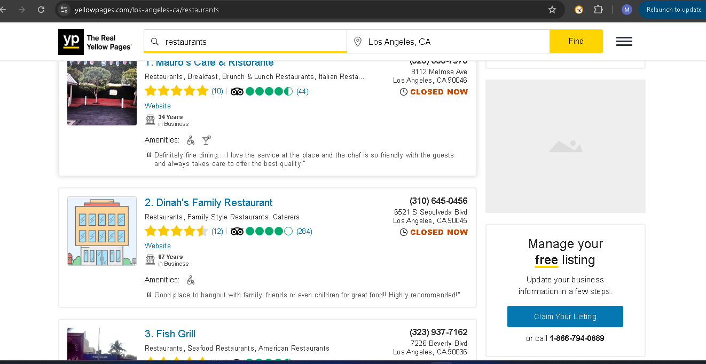
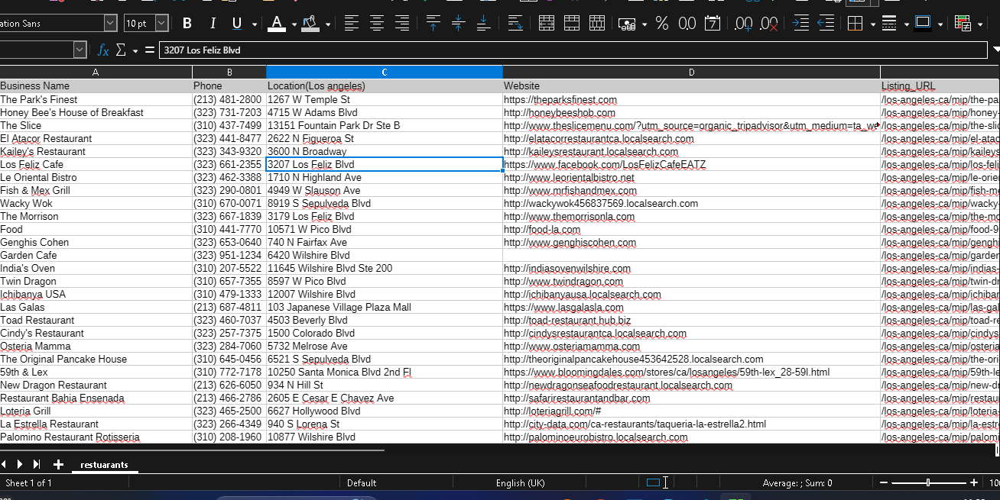

# Yellowpages Restaurant Scraper

A Python based web scraper that collects restaurant business information from Yellowpages.com using Selenium, JavaScript "fetch()", and lxml.

The scraper retrieves HTML data from the site's endpoint, extracts restaurant information, uses MySQL for deduplication, and exports the final dataset to a CSV file.

This project was built as a practical web scraping and data extraction project for skill development and portfolio purposes.

## 🚀 Features

- Scrapes restaurant listings from Yellowpages.com
- Uses Selenium to establish a browser session
- Uses JavaScript "fetch()" to retrieve the HTML response from the endpoint
- Parses the returned HTML using lxml
- Extracts:
  - Business name
  - Phone number
  - Location
  - Website
  - Listing URL
- Handles pagination
- Scrapes up to 10 pages(any amount of pages you want)
- Uses MySQL for data storage and deduplication
- Loads processed data back into Python
- Exports the final dataset to CSV
- Includes error handling
- Includes retry mechanisms for browser and page-loading operations

## 🛠️ Technologies Used

- Python
- Selenium – for browser automation and establishing the browser session
- JavaScript Fetch API – for retrieving the HTML response from the endpoint
- lxml – for parsing and extracting information from the HTML document
- MySQL – for storing scraped data and handling deduplication
- mysql-connector-python – for connecting Python to MySQL
- CSV – for the final data output

## 🔄 How It Works

The scraper follows this workflow:

Yellowpages.com
       ↓
Open Homepage with Selenium
       ↓
Establish Browser Session
       ↓
JavaScript fetch()
       ↓
HTML Endpoint Response
       ↓
lxml HTML Parsing
       ↓
Extract Restaurant Data
       ↓
MySQL Database
       ↓
Deduplication
       ↓
Load Data Back to Python
       ↓
Export to CSV

## 🌐 Data Retrieval Approach

One of the main challenges in this project was retrieving the HTML response from Yellowpages.com.

Although the website's content was returned as HTML, a simple "requests" request was not sufficient to retrieve the desired response because the server expected the request to come from a browser environment.

To handle this, Selenium was used to open the Yellowpages.com homepage and establish a browser session.

The scraper then used JavaScript's "fetch()" method through Selenium to request the required endpoint.

The endpoint returned an HTML document containing the restaurant information.

The returned HTML was then passed to lxml for parsing.

This approach allowed the scraper to combine browser based request handling with efficient HTML parsing.

## 🍽️ Data Extracted

For each restaurant listing, the scraper extracts:

Field| Description
"business_name"| Name of the restaurant
"phone"| Restaurant phone number
"location"| Business location/address
"website"| Restaurant's external website
"listing_url"| Yellowpages.com listing URL

## 📄 Pagination

The scraper handles pagination and processes up to 10 pages of restaurant listings.

The pagination system allows the scraper to move through multiple result pages and collect restaurant information from each page.

Page 1 ->Page 2 ->Page 3 ->... Page 10

## 🗄️ MySQL Database

The scraped information is stored in a MySQL database.

The database is used primarily to help with deduplication.

The workflow is:

Scraped Data
     ↓
MySQL Database
     ↓
Check Existing Records
     ↓
Remove/Prevent Duplicates
     ↓
Load all Data Stored Back to Python
     ↓
Export to CSV

Using a database provides persistent storage and allows the scraper to manage duplicate business records before generating the final dataset.

## 🖼️ Screenshots
The interface of the website image.

Final CSV Output image

## 🔁 Reliability

The scraper includes error handling and retry mechanisms in important parts of the scraping process.

Retries are implemented in functions responsible for:

- Opening the browser
- Loading the required site/page

This helps the scraper recover from temporary failures instead of immediately terminating the scraping process.

## ⚙️ Installation
1. clone the repository

2. Install the required dependencies:

       - pip install -r requirements.txt

Make sure the required browser and Selenium driver configuration is available before running the scraper.

## 🔐 Configuration

The project requires database credentials, they should be stored securely using environment variables rather than being hard-coded in the source code.

## ▶️ Running the Scraper

After installing the dependencies and configuring the database, run:

python main.py

The scraper will:

1. Open Yellowpages.com using Selenium.
2. Establish the browser session.
3. Use JavaScript "fetch()" to request the required endpoint.
4. Retrieve the HTML response.
5. Parse the HTML using lxml.
6. Extract restaurant information.
7. Process up to 10 pages.
8. Store the data in MySQL.
9. Handle duplicate records.
10. Load the processed data back into Python.
11. Export the final dataset to CSV.

## 🎯 Project Goals

This project was created to strengthen practical skills in:

- Web scraping
- Data extraction
- Browser automation
- HTML parsing
- JavaScript-based data retrieval
- Pagination
- Database integration
- Deduplication
- CSV data processing
- Error handling
- Retry mechanisms

## 📚 What I Learned

This project provided practical experience with a more challenging scraping scenario where simply sending HTTP requests was not sufficient to obtain the required HTML response.

I learned how to combine different technologies to create a complete data extraction workflow:

Browser Automation
        +
JavaScript Fetch
        +
HTML Parsing
        +
Database Storage
        +
Deduplication
        +
CSV Export

The project also helped me understand that different websites may require different scraping approaches depending on how their servers and pages handle requests.

## ⚠️ Disclaimer

This project is intended for educational and portfolio purposes. When accessing or collecting data from external websites, users should respect the website's terms of use, robots policies where applicable, applicable laws, and reasonable request limits.

## 👤 Author

Maxwell Tetteh